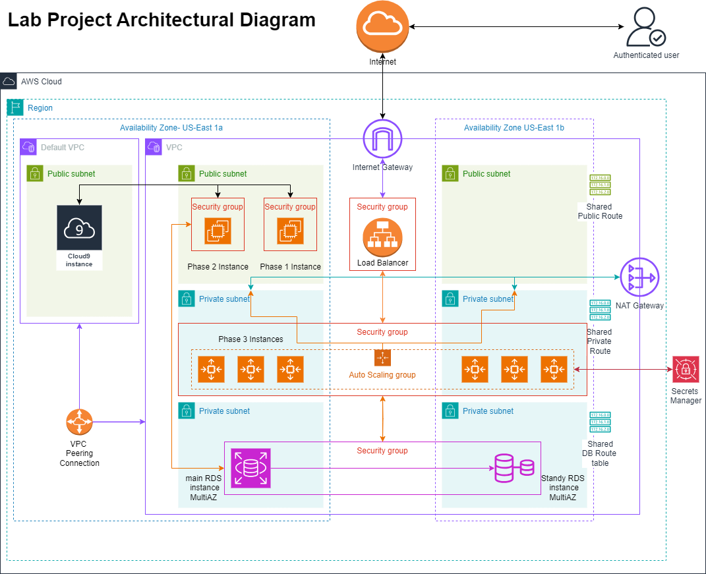

# AWS Projects

# Project Documentation

## Project Structure
     ______________
    /_AWS-Project_./
       │ │        ├── launcher.sh
     __│ │____
    /__env__./
       │ │  ├── variables.env
      _│ │_________________________________________________________________________________________
     /_core_./           /_phase_files_./             /_data_./                     /_asg_config_./
            ├── root.sh                ├── phase1.sh         ├── ec2_v1_userdata.sh              ├── config.json 
            ├── phase_worker.sh        ├── phase2.sh         ├── ec2_v2_userdata.sh
            ├── config.sh              ├── phase3.sh         ├── sample_entries.sql
            ├── map_build.sh           ├── phase4.sh 
            ├── caller.sh              ├── phase5.sh 
            ├── constants.env 

## Overview
This project provides an automated system for provisioning and managing an AWS-based infrastructure for a web application. It includes scripts to configure Virtual Private Clouds (VPCs), subnets, EC2 instances, RDS databases, autoscaling, load balancing, and cleanup of resources during deployment.
The code is organized into five phases, each handling a specific aspect of the infrastructure setup. The system is designed to be modular and extensible, allowing users to customize configurations and add new features as needed.
---

## Key Features
1. **Infrastructure Automation**: Provisioning AWS resources such as EC2 instances, RDS databases, subnets, security groups, load balancers, and autoscaling groups.
2. **Database Management**: Migration of database content from local storage to an RDS instance.
3. **Scalability**: Autoscaling configuration to handle varying loads.
4. **Logging and Error Handling**: Extensive logs are maintained for execution and error tracking.
5. **Cleanup Utility**: Scripts to delete and clean up resources.

---



---

## Stages of Execution
                                      
     launcher.sh  
     __│ │____                                           
    /root.sh/                                               
       │ │  ├── variables.env                                              
       │ │  ├── launcher.env                                                     
      _│ │_________________________________________________________________________________________
     /_core_./           /_phase_files_./             /_data_./                     /_asg_config_./
            ├── root.sh                ├── phase1.sh         ├── ec2_v1_userdata.sh              ├── config.json 
            ├── settings.sh            ├── phase2.sh         ├── ec2_v2_userdata.sh
            ├── phase_worker.sh        ├── phase3.sh         ├── sample_entries
            ├── config.sh              ├── phase4.sh 
            ├── map_build.sh           ├── phase5.sh 
            ├── caller.sh  
            ├── constants.sh 

#### 1.  System launcher.sh
The system launcher script `launcher.sh` is the entry point for executing the infrastructure setup. It defines the folder structure and calls the `root.sh` script to start the process.

#### 2.  root.sh
The `root.sh` script initializes the `variables.env`, `constants.env`, `config.sh` and `phase_worker.sh`scripts, requests user for the database password, and calls the `phase_worker.sh` script to execute the phases of infrastructure sequentially in an infinite loop.
The phases are implemented in an infinite loop to allow the developer to modify the coode during runtime. This is useful for debugging and testing purposes.
At the end of each loop, the user is prompted to enter 'y' to return to the 1st phase or 'n' to exit the script.

#### 3.  variables.env
This is the input file for the script. These are the variables that are used in the script. The user can change the values of the variables in this file.

#### 4.  constants.env
This file contains the constants that are used in the script, required for the script to run.

#### 5.  config.sh
This file contains the settings for the script. 
Some of the settings can be modified by the user to suit their needs.

#### 5.  phase_worker.sh
This script is the main logic of the script. It calls the phase files in the order of execution and logs information about the deployment on the console and in log files.
In here, there is an option to skip each phase of the deployment. The user can choose to skip a phase by entering 'y' or 'n' when prompted. If the user chooses to skip a phase, the script will skip the phase and move on to the next phase. If there is no response from the user, the script will wait 60 seocnds before moving on to the next phase.
It also checks the error status of previous phases and skips the current phase if there is an error in the previous phase.

#### 6.  Phase 1.sh
This script is the first phase of the deployment. It creates a custom VPC with subnets (public, private, and database), sets up security groups, VPC Peering connections, a NAT Gateway, and an Internet Gateway. It launches an EC2 instance with a default in-memory database in the public subnet.

#### 7.  Phase 2.sh
This script is the second phase of the deployment. It involves creating security groups, extracting a database dump from the EC2 instance, creating an RDS instance, and migrating the database from the EC2 instance to the RDS instance. It also involves launching a new EC2 instance and configuring it to communicate with the RDS instance.
#### 8.  Phase 3.sh
This script is the third phase of the deployment. It involves creating security groups, creating an image of the RDS-connected EC2 instance, and creating a launch template, and launching an auto-scaling group. It also involves setting up a load balancer, and linking these resources together.
#### 9.  Phase 4.sh
This script is the fourth phase of the deployment. It involves load testing the auto-scaling group to ensure it can handle high traffic. I have deactivted this phase as it is not required for the deployment.

#### 10. Phase 5.sh
This script is the fifth phase of the deployment. It involves cleaning up all the resources that were created during the deployment. It deletes almost all the resources that were created during the deployment. The Created VPC however is not deleted as it would contain the security groups. If the user wants to delete the VPC, and security groups, they should delete the VPC manually as this will also delete the security groups.
The user will also have to return to the Cloud9 instance's security group and delete the entries that were created during the deployment.


#### 11. Other Files
Preexisting files in the project include:
- `ec2_v1_userdata.sh` and `ec2_v2_userdata.sh`: User data scripts for EC2 instances.
- `config.json`: Configuration file for the auto-scaling group.
- `sample_entries.sql`: Sample entries for the database.

Files created during execution include:
- `execution.log`: Logs the execution of commands.
- `response.log`: Logs the responses from AWS CLI commands.
- `created_resources.log`: Logs the resources created during the execution.
- `xxxxxx.pem`: Two key pair for EC2 - public instances. one for the public instances and one for the private instances.


----------------------------------------------------------------------------------------------------------------------------

# **Procedure**:
## Instructions to Set Up a Cloud9 Environment with SSH Access and Deploy a Project

### Step 1: Set Up Your Cloud9 Environment
1. **Sign in to AWS Management Console**:  
   Go to [AWS Console](https://aws.amazon.com/console/).

2. **Navigate to Cloud9**:  
   - Search for **Cloud9** in the search bar and open the service.

3. **Create a New Environment**:  
   - Click **Create environment**.
   - Provide an environment name (e.g., `MyCloud9Env`).
   - Select **Connect to an EC2 instance using SSH** under **Environment settings**.
   - Use the default VPC and Keep it in one of the final zones you will be deploying your resources. (to reduce VPC peering costs)
   - Modify the instance's idle time by editing the Sleep time while creating the environment. Select at least 1 hour. This will prevent the environment from shutting down during long deployments.
---

### Step 2: Set Up the Project in Cloud9
1. **Open the Cloud9 IDE**:  
   - Once the environment is ready, click **Open IDE**.

2. **Download Project Files**:  
   - Run the following command in the Cloud9 terminal to clone the project repository:
     ```sh
     git clone https://github.com/jayadeyemi/AWS-Cloud-Web-Application-Builder
     ```

3. **Navigate to the Project Directory**:  
   - Change into the cloned repository directory:
     ```sh
     cd AWS-Cloud-Web-Application-Builder
     ```

---

### Step 3: Configure and customize the project

1. **Set Environment Variables**:  
   - Update the `variables.env` file with the required user inputs.
   - Modify the `config.sh` file to customize settings for the deployment.
   I believe the comments in the files are self-explanatory.
   
---

### Step 4: Deploy Your Application
Run the deployment commands provided in the project's README or deployment scripts. Ensure sufficient permissions are set for the deployment process.
```sh
   . ./launcher.sh
```
---
---
---
#### Conclusion
This project provides a comprehensive solution for automating the provisioning, partial management, and cleanup of AWS resources for a web application. By following the phases of execution, users can set up a scalable and robust infrastructure with ease. (30 minutes to 45 minute deployment time)

